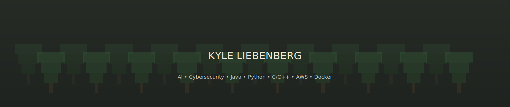

<!--  ─────────────────────────────  HERO  ─────────────────────────────  -->
<p align="center">
  <!-- Animated banner (self‑hosted SVG). Save as /assets/forest-banner.svg -->
  
</p>

<p align="center">
  <!-- Your 3D pixel name art (drop into /assets/Name.png) -->
  
</p>

<!-- Typing intro (external service) -->
<p align="center">
  <a href="#">
    
  </a>
</p>

<!-- Pixel divider -->
<p align="center">
  
</p>

<!--  ─────────────────────────────  QUICK FACTS  ─────────────────────────────  -->

<table align="center">
<tr>
<td>

### WHO AM I?!
I am a final year Computer Science student at the university of pretoria, and have been working with computers and programming for over 7 years. I enjoy mathematics and problem solving which has been my driving force to enter this field of study. Recently, my interest has expanded into the world of Artificial Intelligence, where I am excited to explore how systems can solve real-world problems. When I'm not working I'm probably at the gym, playing pool, losing in chess, but most likely am dead asleep.
</td>
<td width="220" align="center">


</td>
</tr>
</table>

<p align="center">
  
</p>

<!--  ─────────────────────────────  SKILLS  ─────────────────────────────  -->

### CRITICAL SKILLS

> Problem‑solving • Mathematics • Data Structures & Algorithms • Physics • Backend Development • Absolute stupendous vibe coder *(joking… mostly)*

### SOFT SKILLS

> Communication • Teamwork & Collaboration • Creativity • Time Management

### HOBBIES

> Gym • Chess • Video Games • Pool & Table Tennis • Nature & Outdoor Adventures/Hikes

### MY PHILOSOPHY

> **Max out all your stats and help others do so too.**

<p align="center">
  
</p>

<!--  ─────────────────────────────  TECH STACK  ─────────────────────────────  -->

### LANGUAGES

<p>
  
  
  
  
  
</p>

### TECH & FRAMEWORKS

<p>
  
  
  
  
  
  
  
  
  
</p>

### NEXT UP...

<p>
  
  
  
</p>

<p align="center">
  
</p>

<!--  ─────────────────────────────  CONTACT  ─────────────────────────────  -->

### REACH ME

- **Email:** <a href="mailto:kylel@dtfx.co.za">kylel@dtfx.co.za</a>
- **Phone:** <a href="tel:+27608348160">+27 60 834 8160</a>
- **LinkedIn:** <a href="https://www.linkedin.com/in/kyle-liebenberg-19a315325" target="_blank">kyle-liebenberg</a>
- **CV (PDF):** [Open CV](assets/CV_Kyle_Liebenberg.pdf)

<p align="center">
  
</p>

<!--  ─────────────────────────────  STATS  ─────────────────────────────  -->

### STATS

<p align="center">
  
  
</p>

<p align="center">
  
</p>

<p align="center">
  
</p>


<p align="center">
  
  
  
</p>

<p align="center">
  
</p>

<p align="center">
  
</p>

<p align="center">
  
</p>


<details>
<summary><b>take a seat...</b></summary>

```
                                        

                                                            
                                               /;-._,-.____        ,-----.__
                                              (_:#::_.:::. `-._   /:, /-._, `._,
                                                  \   _|`"=:_::.`.);  \ __/ /
                                                    ,    `./  \:. `.   )==-'
                                         ., ,-=-.  ,\, +#./`   \:.  / /
                                          \/:/`-' , ,\ '` ` `   ): , /_  -o
                                          /:+- - + +- : :- + + -:'  /(o-) \)     .
                                       ,=':  \    ` `/` ' , , ,:' `'--".--"---._/`7
                                      (    \: \,-._` ` + '\, ,"   _,--._,---":.__/
                                            \:  `  X` _| _,\/'   .-'
            (                 ,&&&.           ":._:`\____  /:'  /
             )                .,.&&               \::.  :\/:'  /
            (  (              \=__/                `.:.  /:'  }
                )             ,'-'.                 ):_(:;   \
          (    (  ,,      _.__|/ /|                /:. _/ ,  |
           ) /\ -((------((_|___/ |               (|::.     ,`
         (  // | (`'      ((  `'--|                |::.    {\
       _ -.;_/ \\--._      \\ \-._/.               |::.\  \ `.
      (_;-// | \ \-'.\    <_,\_\`--'|              |:::(\    |
      ( `.__ _  ___,')      <_,-'__,'      O       |:::/{ }  |                  (o
       `'(_ )_)(_)_)'                       )  ___/#\::`/ (O "==._____   O, (O  /`
```
</details>


<p align="center">
  
</p>

<!--  ─────────────────────────────  FOOTER  ─────────────────────────────  -->

---

<p align="center">

</p>