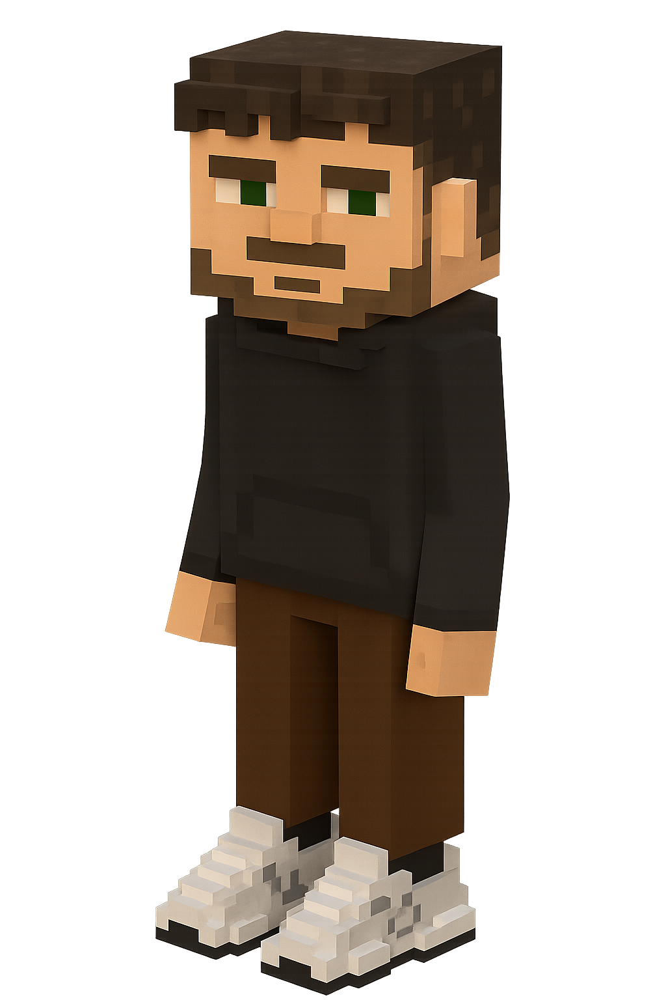
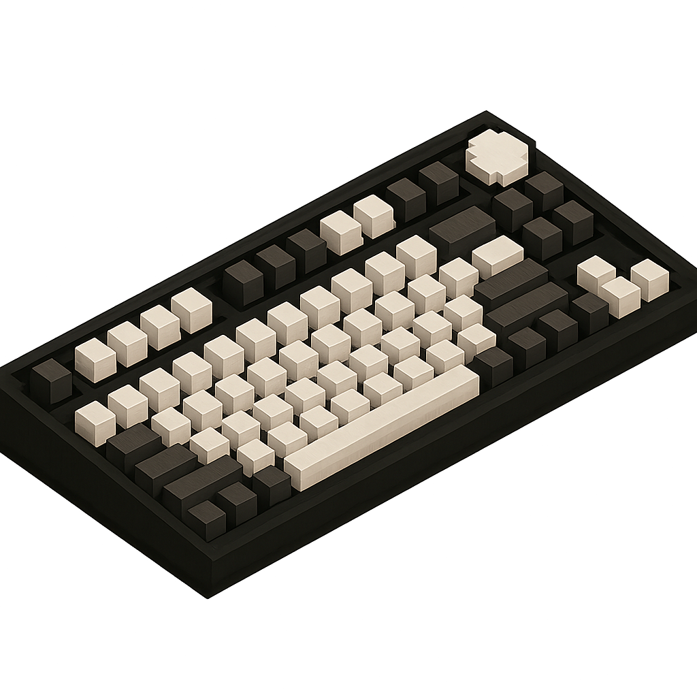

<!--  ─────────────────────────────  HERO  ─────────────────────────────  -->

  

<!-- Typing intro (external service) — color set to brown -->

  

<!-- Pixel divider -->

  

<!--  ─────────────────────────────  CHARACTER LOADOUT  ─────────────────────────────  -->

  

<!-- TABLE 1 — Character Description | Avatar (65% | 35%) -->
<table align="center" width="100%">
  <tr>
    <td style="vertical-align:top; width:65%; padding-right:10px;">
      <h4>Character Description</h4>
      I am a final year Computer Science student at the University of Pretoria, and have been working with computers and programming for over 7 years.
      I enjoy mathematics and problem solving which has been my driving force to enter this field of study. Recently, my interest has expanded into
      the world of Artificial Intelligence, where I am excited to explore how systems can solve real-world problems. When I'm not working I'm probably
      at the gym, playing pool, losing in chess, hiking in nature, but most likely am dead asleep.
    </td>
    <td style="vertical-align:top; width:35%; text-align:center;">
      
    </td>
  </tr>
</table>

<!-- keep divider as is -->

  

<!-- TABLE 2 — Primary | Secondary (50% | 50%) -->
<table align="center" width="100%">
  <tr>
    <td style="vertical-align:top; width:50%; text-align:center; padding-top:4px;">
      <h4>Primary</h4>
      
    </td>
    <td style="vertical-align:top; width:50%; text-align:center; padding-top:4px;">
      <h4>Secondary</h4>
      
    </td>
  </tr>
</table>

<!-- keep divider as is -->

  

<!-- TABLE 3 — Stats rows with 1/4 : 3/4 split -->
<table align="center" width="100%">

  <!-- Critical Skills -->
  <tr>
    <td style="vertical-align:middle; width:25%; text-align:center; padding-top:10px;">
      
    </td>
    <td style="vertical-align:top; width:75%; padding-top:10px;">
      <!-- 10-block meters: 🟫 filled, ⬜ empty -->
      
<b>Problem-solving</b> — 🟫🟫🟫🟫🟫🟫🟫🟫🟫⬜ 9/10

      
<b>Mathematics</b> — 🟫🟫🟫🟫🟫🟫🟫🟫⬜⬜ 8/10

      
<b>Data Structures & Algorithms</b> — 🟫🟫🟫🟫🟫🟫🟫⬜⬜⬜ 7/10

      
<b>Physics</b> — 🟫🟫🟫🟫🟫🟫⬜⬜⬜⬜ 6/10

      
<b>Backend Development</b> — 🟫🟫🟫🟫🟫🟫🟫⬜⬜⬜ 7/10

      
<b>Stupendous Vibe Coder</b> *(joke)* — 🟫🟫🟫🟫🟫🟫🟫🟫🟫🟫 10/10

    </td>
  </tr>

  <!-- Soft Skills -->
  <tr>
    <td style="vertical-align:middle; width:25%; text-align:center; padding-top:18px;">
      
    </td>
    <td style="vertical-align:top; width:75%; padding-top:18px;">
      
<b>Communication</b> — 🟫🟫🟫🟫🟫🟫🟫⬜⬜⬜ 7/10

      
<b>Teamwork & Collaboration</b> — 🟫🟫🟫🟫🟫🟫🟫⬜⬜⬜ 7/10

      
<b>Creativity</b> — 🟫🟫🟫🟫🟫🟫🟫🟫⬜⬜ 8/10

      
<b>Time Management</b> — 🟫🟫🟫🟫🟫🟫🟫⬜⬜⬜ 7/10

    </td>
  </tr>

  <!-- Hobbies -->
  <tr>
    <td style="vertical-align:middle; width:25%; text-align:center; padding-top:18px;">
      
    </td>
    <td style="vertical-align:top; width:75%; padding-top:18px;">
      
<b>Gym</b> — 🟫🟫🟫🟫🟫🟫🟫🟫⬜⬜ 8/10

      
<b>Chess</b> — 🟫🟫🟫🟫⬜⬜⬜⬜⬜⬜ 4/10

      
<b>Video Games</b> — 🟫🟫🟫🟫🟫🟫🟫⬜⬜⬜ 7/10

      
<b>Pool & Table Tennis</b> — 🟫🟫🟫🟫🟫🟫⬜⬜⬜⬜ 6/10

      
<b>Nature & Hikes</b> — 🟫🟫🟫🟫🟫🟫🟫🟫🟫⬜ 9/10

    </td>
  </tr>

  <!-- Philosophy -->
  <tr>
    <td style="vertical-align:middle; width:25%; text-align:center; padding-top:18px;">
      
    </td>
    <td style="vertical-align:top; width:75%; padding-top:18px;">
      
<b>Max out all your stats & help others do so too</b> — 🟫🟫🟫🟫🟫🟫🟫🟫🟫🟫 10/10

    </td>
  </tr>
</table>

  

<!--  ─────────────────────────────  CONTACT  ─────────────────────────────  -->

  

- **Email:** <a href="mailto:kylel@dtfx.co.za">kylel@dtfx.co.za</a>
- **Phone:** <a href="tel:+27608348160">+27 60 834 8160</a>
- **LinkedIn:** <a href="https://www.linkedin.com/in/kyle-liebenberg-19a315325" target="_blank">kyle-liebenberg</a>
- **CV (PDF):** [Open CV](assets/CV_Kyle_Liebenberg.pdf)

  

<!--  ─────────────────────────────  STATS  ─────────────────────────────  -->

  

  
  

  

  

  
  
  

  

  

  

  

  

  

